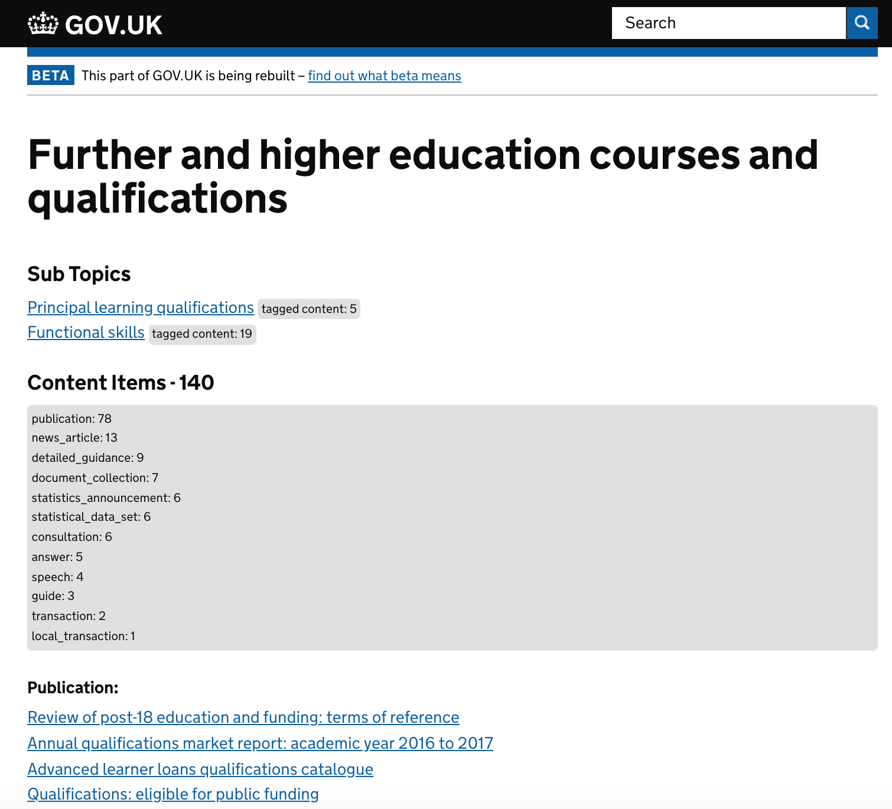

# Deprecated
This repo is no longer used or maintained. Topic pages which surface the sitewide taxonomy (and which this prototype was used to inform) are now live on GOV.UK and live within [the Collections app](https://github.com/alphagov/collections/tree/master/app/views/taxons).

# GOVUK Topic Pages Prototype (2018)

## Purpose
This prototype was created as an initial prototype for topic pages which display the taxonomy. The prototype:

- Surfaces tagged content at each level of the taxonomy
- Displays the total count of tagged content at each level
- Groups documents by document type

It does not contain any styling - the main aim of the prototype was to surface content so that this could be analysed and used to inform design.




## Development

The application can be run using the startup file provided:

```
bundle install
./startup.sh
```

To run using live content store, static, rummager and search URIs, include the `--live` flag, e.g: `./startup.sh --live`

By default, it runs on port 3000, e.g: `localhost:3000`

## Heroku
The master build is automatically deployed to heroku at [https://govuk-topic-pages-prototype.herokuapp.com](https://govuk-topic-pages-prototype.herokuapp.com).

## Licence

[MIT License](LICENCE)
